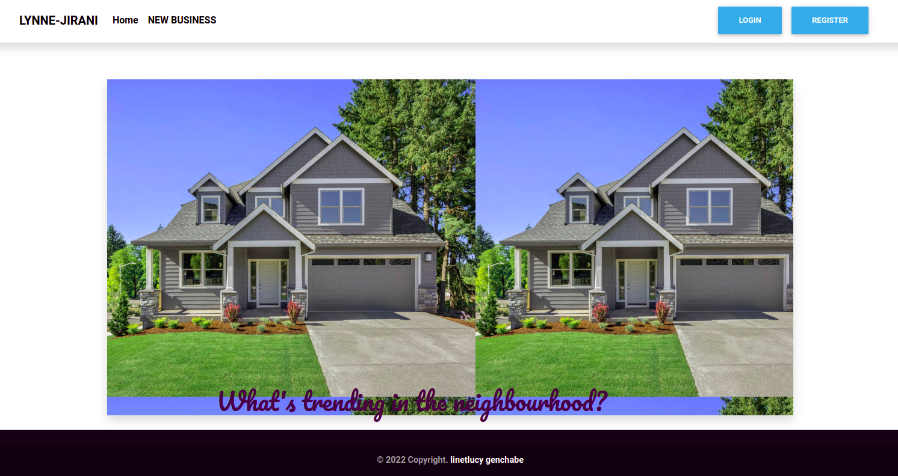
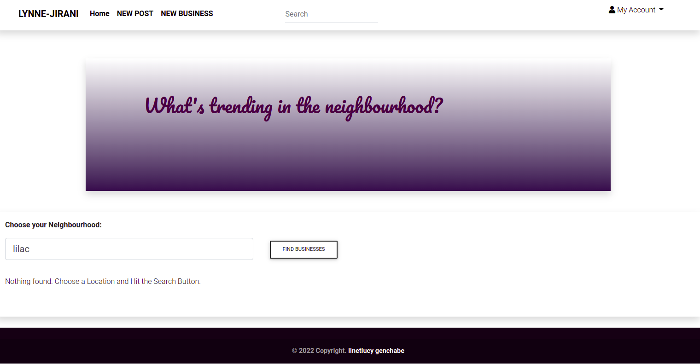

## Neighbourhood Trends
# Author
Linetlucy Genchabe

## Description
This is a web application that allows you to be in the loop about everything happening in your neighborhood. From contact information of different handyman to meeting announcements or even alerts.

## User Stories
## User Story

* Users need to Sign in to the application to start using it

* Users can Set up a profile about them and a general location and their neighborhood name

* Users Find a list of different businesses in my neighborhood.

* Users can search for different businesses in their neighborhood.

*  Users can Find Contact Information for the health department and Police authorities near my neighborhood. 

*  Users can Change their neighborhood when I decide to move out.

*  Users can Only view details of a single neighborhood.

## Home 

## SETUP AND INSTALLATION 
### Prerequisites
* python3.8
* virtual environment
* pip

### Cloning
* In your terminal:
        
        $ git clone https://github.com/linetlucy-genchabe/Neighbourhood-Trends.git
        $ cd Neighbourhood-Trends

## Running the Application
* Install virtual environment using `$ python3.8 -m venv --without-pip virtual`
* Activate virtual environment using `$ source virtual/bin/activate`
* Download pip in our environment using `$ curl https://bootstrap.pypa.io/get-pip.py | python`
* Install all the dependencies from the requirements.txt file by running `python3.8 pip install -r requirements.txt`
* Create a database and edit the database configurations in `settings.py` to your own credentials.
* Make migrations

        $ python manage.py makemigrations watch
        $ python3.8 manage.py migrate 

* To run the application, in your terminal:

        $ python3.8 manage.py runserver

## Technologies Used
- Python3.8
- Django
- HTML
- Bootstrap
- cloudinary 
- Postgres Database

## live link 

https://lynne-neighbourhood.herokuapp.com/

## License
MIT license

## Author's Info

* linetlucy21@gmail.com  

    &copy; 2022 @Linetlucy Genchabe.

